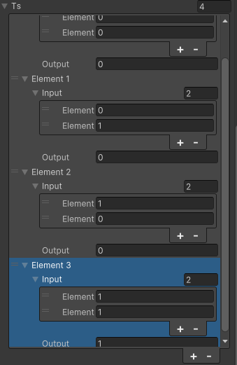
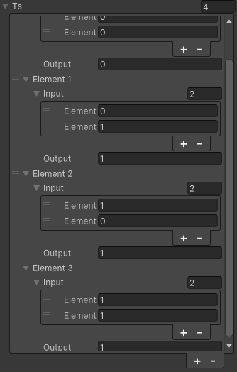
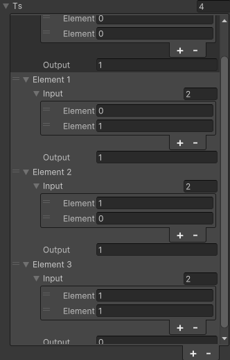
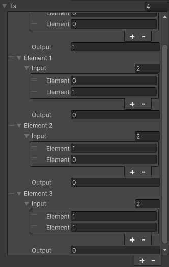
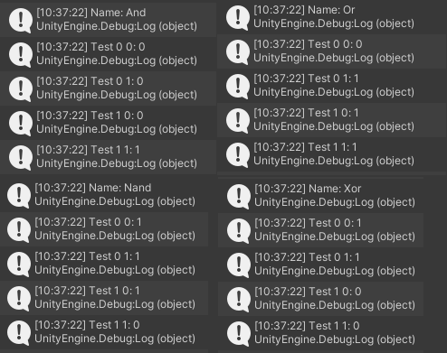
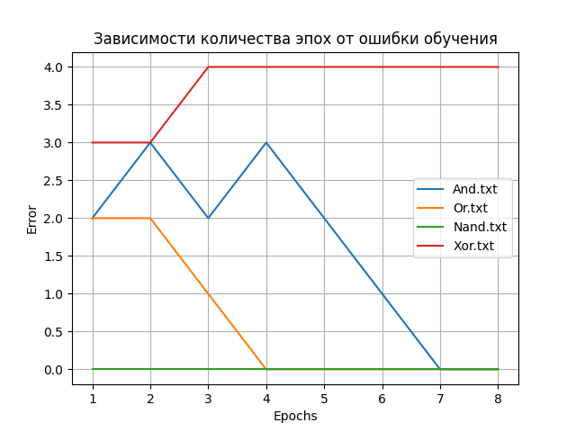
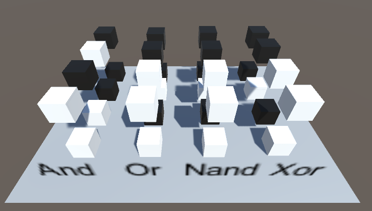
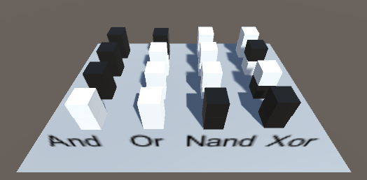

# АНАЛИЗ ДАННЫХ И ИСКУССТВЕННЫЙ ИНТЕЛЛЕКТ [in GameDev]

Отчет по лабораторной работе #4 выполнил(а):

- Ярочкина Валентина Эдуардовна
- РИ220941
Отметка о выполнении заданий:

|Задание|Выполнение|Баллы|
|---|---|---|
|Задание 1|*|60|
|Задание 2|*|20|
|Задание 3|*|20|

знак "*" - задание выполнено; знак "#" - задание не выполнено;

Работу проверили:

- к.т.н., доцент Денисов Д.В.
- к.э.н., доцент Панов М.А.
- ст. преп., Фадеев В.О.

[](https://nodesource.com/products/nsolid)

[](https://travis-ci.org/joemccann/dillinger)

Структура отчета

- Данные о работе: название работы, фио, группа, выполненные задания.
- Цель работы.
- Задание 1.
- Код реализации выполнения задания. Визуализация результатов выполнения (если применимо).
- Задание 2.
- Код реализации выполнения задания. Визуализация результатов выполнения (если применимо).
- Задание 3.
- Код реализации выполнения задания. Визуализация результатов выполнения (если применимо).
- Выводы.
- ✨Magic ✨

## []()Цель работы

Подключить модель `Perceptron` к Unity GameObject и обучить его.

## []()Задание 1

### Реализовать перцептрон, который умеет производить вычисления в Unity проекте

Используя скрипт перцептрона `Perceptron.cs`, задать данные для обучения перцептрона в инспекторе Unity.

- AND
	Таблица истинности

|Значение 1|Значение 2|Результат|
|---|---|---|
|1|1|1|
|1|0|0|
|0|1|0|
|0|0|0|



- OR
	Таблица истинности

|Значение 1|Значение 2|Результат|
|---|---|---|
|1|1|1|
|1|0|1|
|0|1|1|
|0|0|0|



- NAND
	Таблица истинности

|Значение 1|Значение 2|Результат|
|---|---|---|
|1|1|0|
|1|0|1|
|0|1|1|
|0|0|1|



- XOR
	Таблица истинности

|Значение 1|Значение 2|Результат|
|---|---|---|
|1|1|0|
|1|0|1|
|0|1|1|
|0|0|0|



На изображении ниже, представлены результаты обучения.


По окончанию обучения можно сделать следующий вывод:
- `AND` - обучен верно и работает корректно.
- `NAND` - обучен верно и работает корректно.
- `OR` - обучен верно и работает корректно.
- `XOR` - не обучен по причине того, что оба пороговых значения (0, 0 и 1, 1) должны давать одинаковый результат, это классическая _**XOR Problem**_ .

##  Задание 2

### Построить графики зависимости количества эпох от ошибки обучения. Указать от чего зависит необходимое количество эпох обучения.

Изменив `Perceptron.cs` таким образом, чтобы после обучения Unity создавала файлы `And.txt`, `Nand.txt`, `Or.txt`,` Xor.txt` с информацией о количестве эпох и ошибках в каждой эпохе. Далее, используем `python` и `matplotlib` для создания линейного графика, отражающего полученные данные.


Из графика можно сделать вывод, что в моем случае для обучения понадобилось:
- `And` - 7 эпох
- `Or` - 4 эпохи
- `Nand` - обучился сразу
- `Xor` - не обучился

Количество эпох обучения перцептрона зависит от сложности задачи, выбора параметров (например, скорости обучения), качества данных, инициализации весов и используемого оптимизационного алгоритма. Такие факторы могут влиять на необходимое количество эпох для достижения оптимальных результатов обучения.

Ниже представлен скрипт на `python`, генерирующий график.

```py
import matplotlib.pyplot as plt  
  
  
# Функция для чтения данных из файла  
def read_file(file_name):  
    x = []  
    y = []  
    with open(file_name, 'r') as file:  
        for line in file:  
            data = line.split()  
            x.append(int(data[0]))  
            y.append(int(data[1]))  
    return x, y  
  
  
# Считываем данные из каждого файла  
file_names = ['And.txt', 'Or.txt', 'Nand.txt', 'Xor.txt']  
for file_name in file_names:  
    x, y = read_file(file_name)  
  
    # Строим график  
    plt.plot(x, y, label=file_name)  
  
# Настройки графика  
plt.xlabel('Epochs')  
plt.ylabel('Error')  
plt.title('Зависимости количества эпох от ошибки обучения')  
plt.legend()  
plt.grid(True)  
  
# Отображаем график  
plt.savefig('Linear')
```

##  Задание 3

### Построить визуальную модель работы перцептрона на сцене Unity

На сцене расположены объекты Cube. Каждый из них отвечает за `True` или `False`:
- `True` - 1 - Белые кубы 
- `False` - 0 - Черные кубы 



При запуске проекта, верхние кубы падают, и, в соответствие с таблицей истинности, кубы изменяют свой цвет. `Xor` в отличии от `And`,  `Or`, `Nand`, не обучен, потому он и не отображается корректно. 



## []()Выводы

В ходе работы был обучен перцептрона в соответствие с таблицей истинности, Построен график, создана визуализация.

Скрипт `Perceptron.cs` в конечном итоге выглядит так:
```с#
using System.Collections;  
using System.Collections.Generic;  
using UnityEngine;  
using System.IO;  
using System;  
using Random = UnityEngine.Random;  
  
[System.Serializable]  
public class TrainingSet  
{  
    public double[] input;  
    public double output;  
}  
  
public class Perceptron : MonoBehaviour  
{  
    public Material mat_T;  
    public Material mat_F;  
  
    public bool value;   
private List<double> _error_list = new();  
    public string Name;  
    public TrainingSet[] ts;  
    double[] weights = {0,0};  
    double bias = 0;  
    double totalError = 0;   
    double DotProductBias(double[] v1, double[] v2)   
    {  
        if (v1 == null || v2 == null)  
            return -1;  
     if (v1.Length != v2.Length)  
            return -1;  
     double d = 0;  
        for (int x = 0; x < v1.Length; x++)  
        {            d += v1[x] * v2[x];        }  
        d += bias;  
     return d;  
    }  
    double CalcOutput(int i)  
    {        double dp = DotProductBias(weights,ts[i].input);  
        if(dp > 0) return(1);  
        return (0);  
    }  
    void InitialiseWeights()  
    {        for(int i = 0; i < weights.Length; i++)  
        {            weights[i] = Random.Range(-1.0f,1.0f);  
        }        bias = Random.Range(-1.0f,1.0f);  
    }  
    void UpdateWeights(int j)  
    {        double error = ts[j].output - CalcOutput(j);  
        totalError += Mathf.Abs((float)error);  
        for(int i = 0; i < weights.Length; i++)  
        {weights[i] = weights[i] + error*ts[j].input[i];   
        }  
        bias += error;  
    }  
    double CalcOutput(double i1, double i2)  
    {        double[] inp = new double[] {i1, i2};  
        double dp = DotProductBias(weights,inp);  
        if(dp > 0) return(1);  
        return (0);  
    }  
    void Train(int epochs)  
    {        InitialiseWeights();  
        Debug.Log("Name: " + Name);  
        for(int e = 0; e < epochs; e++)  
        {            totalError = 0;  
            for(int t = 0; t < ts.Length; t++)  
            {                UpdateWeights(t);  
                Debug.Log("W1: " + (weights[0]) + " W2: " + (weights[1]) + " B: " + bias);  
            }            Debug.Log("TOTAL ERROR: " + totalError);  
            _error_list.Add(totalError);  
        }    }  
    void Start () {  
        Train(8);  
        var filePath = Path.Combine(Application.persistentDataPath, Name + ".txt");  
        try  
        {  
            using (var writer = new StreamWriter(filePath))  
                for (var i = 0; i <  _error_list.Count; i++)  
                {                    writer.WriteLine((i + 1) + " " + _error_list[i]);  
                }            Debug.Log("Path: " + filePath);  
        }        catch (Exception e)  
        {            Debug.LogWarning("WritingError: " + e.Message);  
        }        Debug.Log("Name: " + Name);  
        Debug.Log("Test 0 0: " + CalcOutput(0,0));  
        Debug.Log("Test 0 1: " + CalcOutput(0,1));  
        Debug.Log("Test 1 0: " + CalcOutput(1,0));  
        Debug.Log("Test 1 1: " + CalcOutput(1,1));       
    }  
    private void OnCollisionEnter(Collision other)    
    {          
Debug.Log(other.gameObject);  
        if (other.gameObject.CompareTag("ValueCube"))  
        {            var rend = GetComponent<Renderer>();    
var v1 = other.gameObject.GetComponent<Perceptron>().value ? 1 : 0;  
            var v2 = value ? 1 : 0;  
            rend.material = CalcOutput(v1, v2) == 1 ? mat_T : mat_F;   
        }  
    }  
    void Update()  
    {}  
}
```

|Plugin|README|
|---|---|
|Dropbox|[plugins/dropbox/README.md][PlDb]|
|GitHub|[plugins/github/README.md][PlGh]|
|Google Drive|[plugins/googledrive/README.md][PlGd]|
|OneDrive|[plugins/onedrive/README.md][PlOd]|
|Medium|[plugins/medium/README.md][PlMe]|
|Google Analytics|[plugins/googleanalytics/README.md][PlGa]|

## [](https://github.com/Den1sovDm1triy/DA-in-GameDev-lab1/blob/main/README.md#powered-by)Powered by

**BigDigital Team: Denisov | Fadeev | Panov**
